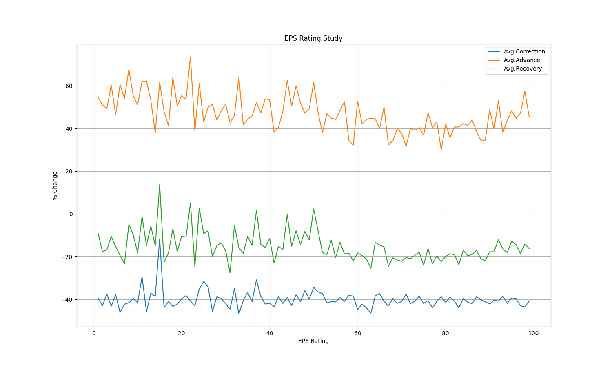

# EPS Rating correlation with correction, advance and recovery

Is earnings growth a good indicator for price increase in various stocks?

We will use EPS Rating as a representation of earnings growth of a stock. 

I picked these three key dates:
* Nasdaq peaked on 2020-02-19.
* Nasdaq bottomed on 2020-03-23. 
* Market correction was for 23 days. I picked twice of that as recovery period. 46 days. That comes out to be 2020-05-28.

I put all stocks in 99 buckets based on their EPS Rating on 2020-02-19 and for each bucket, I calculated these stats: 
1. Average Correction: price change from 2020-02-19 to 2020-03-23
1. Average Advance: price change from 2020-03-23 to 2020-05-28
1. Average Recovery: price change from 2020-02-19 to 2020-05-28

This is what I found:

As can be seen in the above chart, it really does not matter what EPS Rating is, the average correction, average 
advance and average recovery is same (with some randomness factor). 

No correlation at all. Stocks with higher EPS Ratings had no edge at all. 
